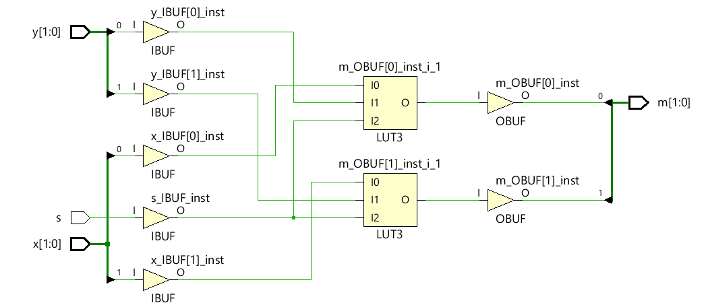

# Mux
[Inspiration for this lab](https://www.xilinx.com/support/documentation/university/Vivado-Teaching/HDL-Design/2015x/Verilog/docs-pdf/lab1.pdf)

Vivado turns all circuits into the primitives of a CLB Slice: LUTs, muxes, carry-logic, xor gates, d flip flops. Understanding these is the goal of this course. We have covered XOR gates and LUTs. The goal now is to cover muxes. 

## 1_1_m2x1Mux-1bitwide

#### Port Diagram

#### 

#### Verilog Code

#### RTL Schematic Screen shot

#### Synthesis Schematic Screen shot

#### Implementation Device screen shot zoomed in on something interesting

#### Testing

SW[0] is x, SW[1] is y, SW[2] is the select line and LED[0] is the output m. SW[2] selects SW[0] or SW[1] and connects it to the LED.  I tested out the switches on the device and experienced that how does mux works.

#### **Questions**/Tasks

*In the rtl schematic screen shot, the two **and gates** are connected to select and not select. Describe what they are doing in terms of what a mux does.*

**A: Just selecting which switch is going to light up the LED.**

*In the rtl schematic screen shot, what does the **or gate** do in terms of what a mux does?* 

**A:Or gate combines the data coming from the switches and select. If any of them is 1. lighting the LED.**

*How does the schematic change after running synthesis?*  **The diagram turned into LUT based diagram.**

*After running synthesis and implementation, clicking on synthesis under RTL, synthesis and Implementation continues to display the LUT based diagram. Not the gate based diagram. Why? Form a reasonable, non-trivial, relevant hypothesis.* **My hypothesis is because this way the diagram more similar to the real life(device) look.** 

 *The black and white design window appears first after running which step of the workflow?* **I recognize it after I am done with run implementation.**

*How what can you click on to see a region of the device window change from some color to white?* **By clicking the files under the leaf cells.**

*White arrows in the screen shot above are helping us see what?* **See the inputs and outputs flow (Data Flow).**	

*How does Data flow in the fpga from left to right, right to left, bottom up, top down?* **From left to right. Found that from the green arrows.**

*What is the verilog symbol for the white line going up at an angle in the device diagram?* **I didn't understand the question.** 

## lab1_1_mux2-1-2bitwide

#### Port Diagram

#### Verilog Code

#### RTL Schematic Screen shot

#### Synthesis Schematic Screen shot

#### Implementation Device screen shot zoomed in on something interesting

#### Testing

One select line now selects between two pair of inputs and displays one of the pairs on LEDs. 

#### Questions/Tasks

*Explain how to zoom in on the above Device Screen Shot.* **It is right click and from left to right bottom.**

*Do you see pictures of muxes in the Device Screen Shot? Are they used?* **Yeah muxes are showed in the picture. Green arrows shows that the muxes are not used.** 

*Which stage of the work flow choose the specific LUT above?* **after you have done with running synthesis.**

*Which stage of the work flow chooses the green lines?* **after implimentation is done, we choose cell connection button from top of the screen.**

*What do the white lines represent?*  **Inputs, select lines and output lines.**

*What do the spots where white lines cross represent?*  **I didn't understand this question exactly but they all go to the the mux chip.** 

## lab1_2_mux2-1-tristate

### Port Diagram

#### Verilog Code

#### RTL Schematic Screen shot

#### Synthesis Schematic Screen shot

#### Implementation Device screen shot zoomed in on something interesting

#### Testing

Two muxes are implemented using the same inputs with the same select line.  So if the two are equal, their outputs should be equal.  SW[0]- a , SW[1]-b,  SW[2]-select, outputs are the first two LEDs. 

#### Questions/Tasks

*In the RTL schematic, what is RTL_Mux g1_i doing?* **it is working as input for g output.**

*Which of the two verilog implemented muxes actually created a tristate symbol in the RTL schematic?* **g_i1 and a and b inputs.**

*After Synthesis, which of the two verilog implemented muxes looks more simple?* 

**The RTL_Mux g1_i** 

*After Synthesis, why hasn't Vivado detected that the two circuits are identical?* 

**because it combines circuit and inputs/outputs**

*After implementation, does the schematic change? If so, put a screen shot here.* **Yes it changed.**

*Do the insides of the device reflect the schematic .. after implementation?* Yes it does.

*What are the truth tables of the one or two LUT(s)? Put a screen shot(s) here.*

*Are the truth tables the same or different? Why would Vivado do this? Is this a bug in Vivado?* **Yes they are different. Vivado doing this because these muxes have different outputs which is different LEDs.**

*Do some tests modifying this project. Can you make the one line of code mux into a 4 input, 2 select line, 1 output mux in one line?* 

## lab1_2_tb_mux2-1-2bitwide

The screen shots and port diagrams above are not going to be done for you. For the rest of the semester, you are to supply the missing diagrams. For example, starting with the RTL screenshot, everything through testing is missing. Describe how to test this circuit. **Crop the screen shots**!

### Port Diagram

#### 

#### Verilog Code

#### Simulation Screen Shot

#### RTL Schematic Screen shot

#### Synthesis Schematic Screen shot

#### 

#### Implementation Device screen shot zoomed in on something interesting

#### Testing

SW0 and SW1 are x1 and x2 and SW2 and SW3 are the y1 and y2inputs. SW7 is select line and there are two outputs. Select line is selecting x1 and x2 not working and y1 and y2 will be working.

#### Questions/Tasks

*tb stands for what?* 

**testbench**

*What verilog code is the top level module, the test or the circuit?* 

**The test**

*The verilog code shares the same port interface as the previous 2bit wide circuit. How is the verilog code different?**

**** **code  groups x[1:0] together and y switches port 0 and port1.And it is simplier****

*What name would you give to this verilog abstraction level?* **RTL language**

**In the simulation, what is the cause of the red box with an X in it above?*

**Unknown value **

*In the simulation, what do the green boxes with numbers in them mean?*

**Switch on and off**

*In the simulation, was all the activity captured or are their changes to the left of the yellow vertical line?*

**No changes to the left. Is started on time zero.**

*Is this simulation associated with RTL, Synthesis or Implementation Vivado analysis?*

**RTL**

*Is this a physics simulation or logic simulation?*

**Logic simulation**

*Can the previous, port-interface identical, circuit be simulated without test verilog code?*

**no because testbench needed to be simulated**

*If it can be, take a screenshot of the Simulation and compare with this one.*

**

**

I am not getting error message but the simulation is not working. **A: There is no data or anything.**

*If it can't be simulated, take a screenshot of the error message and form a hypothesis of what it is trying to tell you in your own words.*

**Look at this line of code**. It has a module name and then () with nothing in them. 

*Where does the test get it's input?* inside ()

*Where does it's output go?* inside() after inputs. 

**The next questions** are about this line of code: /ENES247-master/lab1-mux/1548766113080.png)

*Which circuit above has the same format of three instructions separated by a space?* 

**similar to mux tristate circuit**

*Does the first section refer to the circuit or the test it's self?*

**refers to circuit**

*DUT stands for Device Under Test. Can this name be changed?*

**it can be changed.** 

*What were some of the names used instead of DUT in the circuit above?* 

*What is the purpose of it?* 

**test of the initial of the circuit**

**The .x(x) format** is different than the circuit above when calling a module. [Suppose this article](http://verilog.renerta.com/mobile/source/vrg00027.htm) is the first you find that describes what is going on. 

*What are the keywords you searched for to find a better article?* 

**Circuit port input/output instantiations**

*What is it's URL?* 

<http://www.asic-world.com/verilog/syntax2.html>

*Is this technique limited to test verilog code or can it be synthesized?* 

**The following questions are about this code block:**

/ENES247-master/lab1-mux/1548767194951.png)

*Is the word "end" the end of the "begin" or the end of initial?*

**It is the end of "begin"**

*Why isn't there a semi-colon after "end"?*

**so it won't cause error.**

*Are the commands under begin executed sequentially or in parallel?*

**Sequentially**

*Are all the possible combinations of x, y and s tested?* 

------

*How many combinations of x,y and s are there?*

27

*Is there a reason that the #20; is intended?*

**Because loop start at 20**

*Does white space matter in verilog?*

**No**

**Read these articles** ... about using initial: [argument](https://forums.xilinx.com/t5/Design-Methodologies-and/quot-initial-quot-statement-with-quot-output-quot-variables/td-p/485782), [pro](http://billauer.co.il/blog/2018/02/verilog-initial-xst-quartus-vivado/), [con](https://www.quora.com/Why-are-initial-blocks-synthesizable-in-FPGA-and-not-in-ASIC), . 

*Which article article supplies the most evidence?*

**Pro article**

The second article (pro) shows more evidence. The author tested each case and showed the results and conclusions. 

*Which article is merely opinion?*

**It can be done**

The third article (con) . They describe what is going to happen, but no one provides data or tests.

**Why are initial blocks can be synthesizable in FPGA and but ASIC**

*Which merely says it is possible?*

**Pro article**

------

------

The first one (argument). They show the codes and what happened, but do not fully describe or explain why.

*What concept is the initial concept linked up to ... that we haven't discussed?*  **clock and memory**

*Make up a rule for yourself regarding using verilog initial command now. You can change in the future. What is this rule?*

**Bigger Picture**

Here are some answered questions that you may have.
*Are there ways to write a verilog test that creates messages such as "pass" or "fail"?* **Yes**
*Are there ways to create verilog loops in the test that cycle through all x,y and s combinations?* **Yes**
Is writing a test in verilog different than creating a circuit in verilog? **Yes**
Are verilog commands used to create tests not synthesized by vendors? **Yes**

Now answer these questions:

*Do you want to learn how to write verilog to test this stuff, or something like java, c++ or python to test?*

**Even Bigger Picture**

**2** *Does the above test actually test with the Vivado implemented FPGA physics or merely test the Verilog logic?* **Verilog Logic.** 
**4** *Does Vivado try to communicate physics or logic to you through "Open Synthesized Design", "Open Implemented Design"?* **Physics**
**3** *Is there a way to build a circuit to test a circuit and put them both in an FPGA?* **Yes**
**1** *Is there a way to collect data about a circuit in FPGA RAM and then dump it to a PC to test?* **Yes .. Is built into Vivado called ILA (integrated logic analyzer)**

*Please rank the above questions by putting a number in front of the with 1 being what you would like to learn first, and 4 being what you would like to learn last .. given that we are working with small circuits.*

*Which of the test methods is more appropriate for a very large project like a CPU?*

## lab1_3_mux2-1-1bitwide-reg

### Port Diagram

#### Verilog Code

#### RTL Schematic Screen shot

#### Synthesis Schematic Screen shot

#### Implementation Device screen shot zoomed in on something interesting

#### Testing

 SW0 and SW1 are x and y inputs. SW7 is the select and it is selecting between them. when select is on x is working when it is 0, y is lighting the LED

#### Questions/Tasks

*This circuit is similar to which previous circuit?* **yes**

The @* is the clearest indication of verilog evolution and the difference between system verilog and regular verilog. Here is a summary. Later we will read the [Cliff Cummings, SunBurst paper](http://www.sunburst-design.com/papers/CummingsSNUG2016SV_SVLogicProcs.pdf) paper on this topic. 

​	always @(y,x) .. too many mistakes, hard to read code ..
​	always @(\*) .. any variable on the right hand side of an equal sign
​	always @\* ..  since 2001 .. just forget the parenthesizes

*Why is there so much verilog code using old forms of the always command on the internet?*

The always @* can not reference a clock. There is no clock in our circuit. It is combinational logic.  One can tell it is combinational logic by looking at the = sign in the begin/end code.  This means that it is executed in sequence .. at near the speed of light. 

*reg stands for what?*A:   **represents storage elements.(registers)**

***What is m driven by in the previous similar circuit?*A:   output.** 

***What is a reg m driven by in this circuit .. when just looking at the verilog code?* A:  output.**

*How is the RTL Schematic of this circuit different the pervious similar circuit?* A:  only one mux 

A reg typically uses a D-flip flop inside an FPGA slice. *Do you see any evidence in the schematic or in the device itself of the reg?*A:  

**Reg without a clock is called a latch. Vivado hates latches. It goes to extremes to eliminate latches.**
Read through the Messages this circuit generates.  *Does any message say it is not creating a reg?*A:  

This verilog code is described by Vivado tutorials as at the behavioral abstraction level (..a good thing.. above RTL abstraction level). *What is good about it since the reg was essentially ignored?*A:  

*Given that RTL programming involves reg, is it a requirement that RTL verilog coding cause the use of an FPGA CLB's D-flip flop?*A:  

*Which verilog code is more "C" like, this code or the previous similar circuit?* *Why?*A:  

This mux can be [implemented with one line of code](https://github.com/ENES-246DigitalElectronics/ENES246/blob/master/-5MuxOfMux/m2x1Mux/m2x1Mux.srcs/sources_1/new/m2x1mux.v):  assign m = s ? x : y;
*Why isn't this talked about above? Why isn't this given the name RTL verilog or Behavioral verilog?*

## lab1_3_mux2-1-2bitwide-reg

The simple mux circuits explored in this lab were created with various forms of the if then else command above. The single line of code is **if else** short hand. But it can not grow larger muxes. But what does a larger mux mean? There are two answers to that question explored below. 

### Port Diagram 

#### Verilog Code

#### RTL Schematic Screen shot

#### 

#### Synthesis Schematic Screen shot

#### Implementation Device screen shot zoomed in on something interesting

#### Testing

SW0 and SW1 are x1 and 2 and SW3 and SW4 are y inputs. SW7 is the select and it is selecting between them. when select is on x's are working when it is 0, y's  are lighting the LED

#### Questions/Tasks

*How is this code different from the previous project?* **ports are in  different places**

Circuits get large several ways. One way is doing many things in parallel.  Parallel is like herding cattle .. the goal being a couple of horses and dogs guiding cattle. Here in select line is guiding the path of 2 cows. *Re-write this code to guide 64 cows.* **changing inputs to [63:0] **

Another [single line of code that synthesizes](https://github.com/ENES-246DigitalElectronics/ENES246/tree/master/-5MuxOfMux/m16x4MuxRTL) a mux is:  assign m = i[s]; 
where i[0]=x and i[1]=y. This scales from having 2 inputs on two wires and 1 select line one wire, to 32 inputs with 5 select lines ... a bigger mux rather than multiple copies of the same mux. *How many select lines would be needed to choose one of 128 cows?*  ******changing inputs to [127:0].******

*Begin [reading this document](https://web.stanford.edu/class/archive/ee/ee371/ee371.1066/tools/verilog_tips.pdf) and then answer this question .. Is it worth trying to create a design tool that can create multiple copies and grow larger at the same time?* **No because it will be longer adn create chaos**

Answer the previous question from the big picture point of view, not from the (is it possible) point of view.  A mux is an old digital design concept. RTL is a new concept. Behavior modeling with verilog **if else** and **reg** is very similar to C. When learning to programming, was learning a mux a pre-requisite? **No.**  *Is it worth learning about a mux?*  **Yes**

*What is the largest mux that would fit in a 6 input LUT?* **2x2 mux**

In the Implementation Device screen, there are pictures of a mux. *Why does vivado implement **if else** in a LUT when it has muxes in the configuration logic blocks (CLB)?* 

[Fast Carry Logic](https://www.xilinx.com/support/documentation/user_guides/ug474_7Series_CLB.pdf) speeds up any math the FPGA does. On page 42 there is this diagram: /ENES247-master/lab1-mux/1548790399124.png)

*When does vivado implement the CLB muxes? * **without used assign command**

*Is fast carry logic a control path or data path concept?* **data path**

## lab1_4_2-mux2-1inSequence

One of the ways we know what is going on is to predict Vivado's behavior. This circuit uses two select lines, but only selects between 3 inputs. Normally two select lines chooses between four inputs. So this is not quite a mux. 

### Port Diagram

#### Verilog Code

#### RTL Schematic Screen shot

#### Synthesis Schematic Screen shot

#### Implementation Device screen shot zoomed in on something interesting

#### Testing

SW0, SW1, SW2 are u, v, w. S0 is SW3 and S1 is SW4. S0 is selecting u and v and their output becomes input for the second mux and S1 is selecting between output of first mux and input w. 

#### Questions/Tasks

*Which of the two modules above is the top level module?*

**mux_3_to_1_instantiation**

*What is the symbol for top level module in the vivado design sources hierarchy?*

**the plus sign**

*Which of the two modules above has nets (wires) mentioned in the XDC file?*

**The one on the left**

mux_3_to_1_instantiation

What are the lower level module instantiation names? 

**U1 and U2**

*What in the XDC file is the wire ul_o connected to?*

Do an experiment.  Change the .x, .y, .z and .m order in the instantiation. *Does the code still produce the same RTL schematic? **It is giving error***

Do another experiment. Remove .x, .y, .s and .m along with the parentheses () in the module instantiation, **but keep the original order that matches the instantiated module**.  *Does this code still produce the same RTL schematic?* **no it is different**

Think about a big project. You start off writing the smaller modules and testing. Then you write larger and larger modules. The larger modules call the smaller modules. Two very different larger modules may re-use the same smaller module.  Port Interface drawings keep track of the net names, but not the order defined in the lower module. Mapping higher module net names to lower module net names means having to know what order they were originally in .. in the lower module.  *Which of the above net mapping techniques between modules makes it only necessary to map wire names, not order?* 

*Does the RTL schematic show the two instantiated modules?*  **Yes**

*What does the Plus sign mean?*

If you click on the plus sign, it opens the gate.

*How does the synthesized schematic change?***combine modules**

*How many LUTs does the synthesized schematic indicate will be used?* 1

*After implementation, does the schematic change?* **No**

The LUT has 5 inputs and a truth table of all their possible combinations.  *Where is this truth table in the Vivado interface (hint: netlist)?*

*Take a screenshot of the truth table and put it here.*

 *Find where I4, I3, .. I0 are mapped to the top level input nets. Put the screen shot here.*

*Is there any order to the mapping?*

## Ethics

These ethics questions are related to the community of engineers working for industry, working for Xilinx, and working to teach about this subject.  Together they have to create standards.  Verilog is called a standard by the IEEE.

*Describe the success of the verilog standard.*  **They made coding easier and more simplier**

*Do you think the IEEE, the largest, international, engineering standards organization, lays down law that Engineers world wide have to follow?*  A**:  No, they don't and they can't.**

*Are engineers involved with precise, universally known best practice that hasn't changed for over 100 years or are technicians?* A**:  most of the fields yes**.

*Why are there all these different ways of implementing a mux in verilog when vivado turns them all into the same thing .. a LUT?*  **Engineers had chance to use several ways to code.**

*If there is one good, true way of implementing a mux in verilog, why not just teach/learn that?* 

**Because it is getting old. We need to find better and easier ways and upgrade.**

*Given the chaos of the verilog standard, does this excite you as an engineer with visions of an opportunity?  Does it give you visions of a job reducing the chaos, unexplored cracks where there are possible significant improvements in productivity, possible unknown territory that the standard hasn't addressed? Or does it depress you?*  **Improving productivity**

*What does chaos feel like?*  **chaos feels like getting confused and not learning anything**

*Describe the tremendous advantages a fresh young mind has when confronted with chaos.* **they can find an opportunity or they would lose their passion**

*Having learned about a chaos, visualize the advantages one has when confronted with one of these opportunities:  .. getting a doctorate, working for Xilinx or using Xilinx tools in a competitive engineering company.* 

*Given that Fortran hasn't changed since the 1960's, C hasn't changed since the 1970's. Java and C++ haven't changed for [decades](https://www.tiobe.com/tiobe-index/), do these languages excite you as an engineer or depress you?* **A:  excites me because we can still do so much with those.**

Almost all software today has verilog code generators including matlab, python, Lab View. A lot of this code will pass Simulation on [EDAplayground](https://www.edaplayground.com/) or will only work with specific hardware.  *What are the chances that generated code will work in Vivado?*   **Vivodo is limited**

*How universal is the digital design process, how universal are the design documents and the symbols they contain that are entered into and looked at in matlab, python and LabView?*

*What is the market share of [Xilinx](https://www.fool.com/investing/2018/04/17/xilinxs-project-everest-looks-like-bad-news-for-in.aspx)?*  **58%**