# Lab 10_ Finite State Machine

## 10-1-1 mealy_sequence_detector_3processes

#### Verilog Code

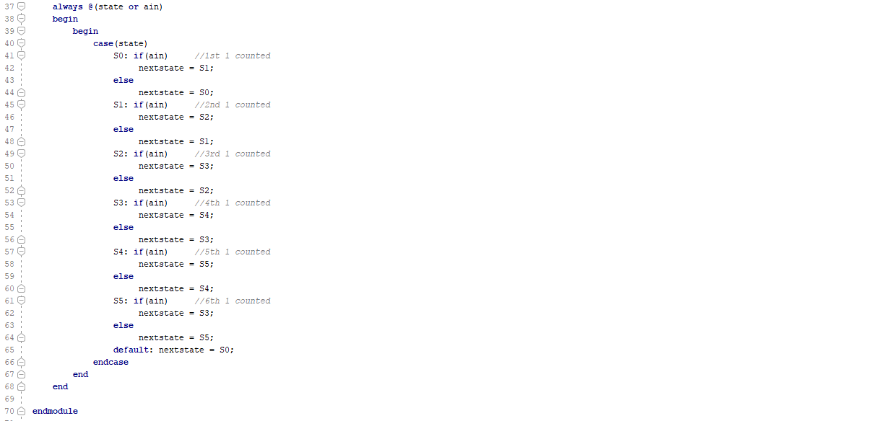

#### RTL

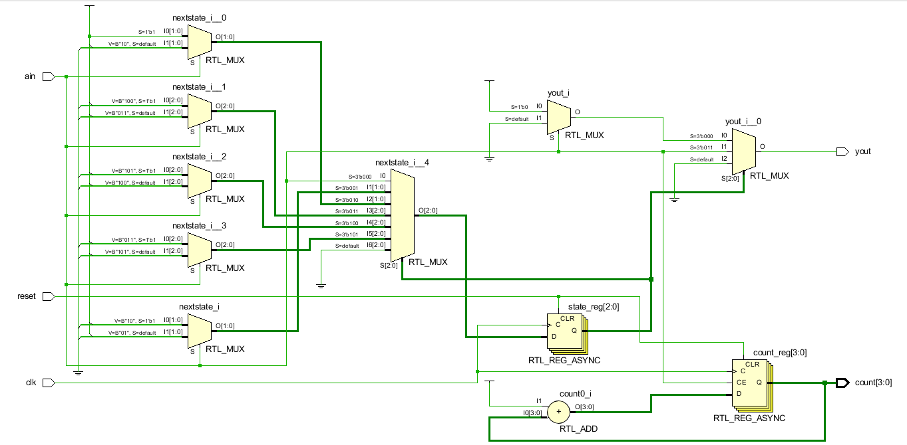

#### Simulation

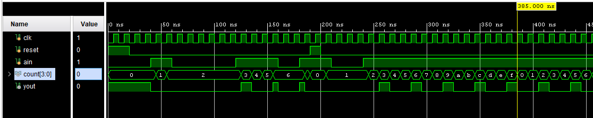

#### Implementation

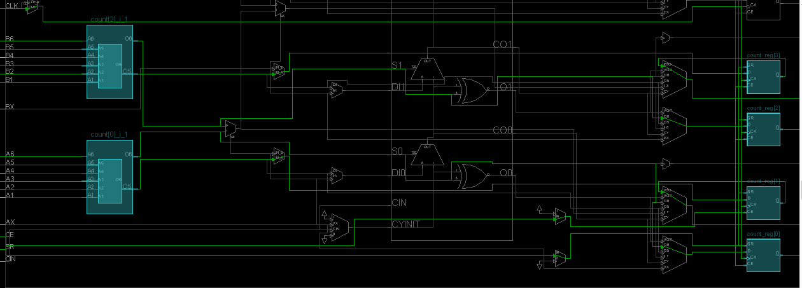

#### Prompt

Each clock tick add one to the output count. Output is 1 when total 1s that sent to the circuit are divisible by 3.

## 10-1-2 moore_sequence_detector_3processes

#### Verilog Code

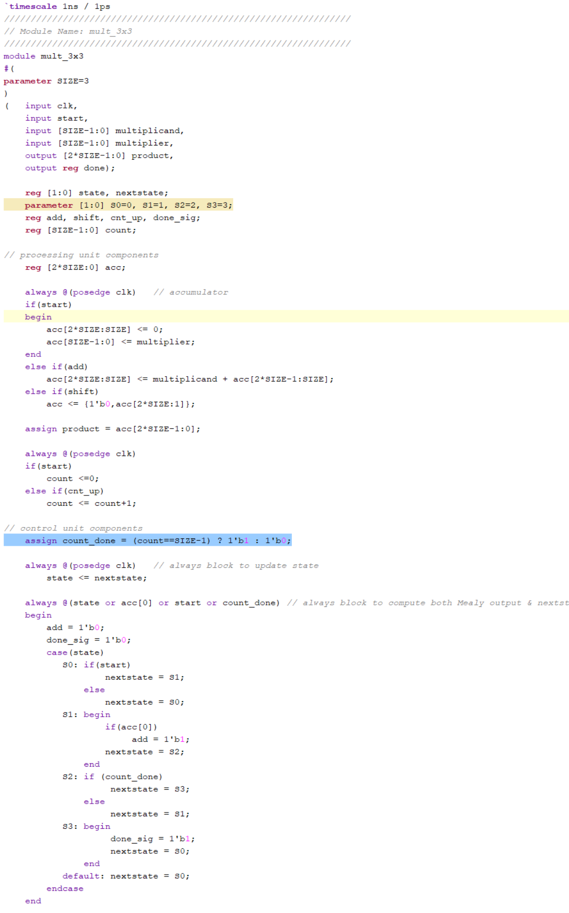

#### RTL

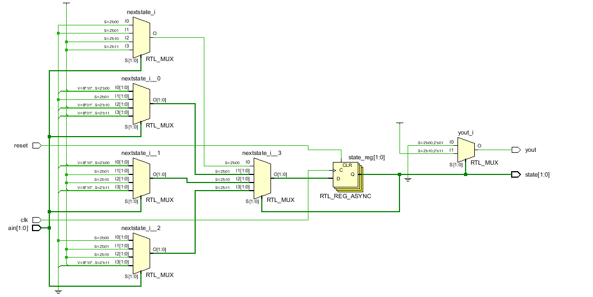

#### Simulation

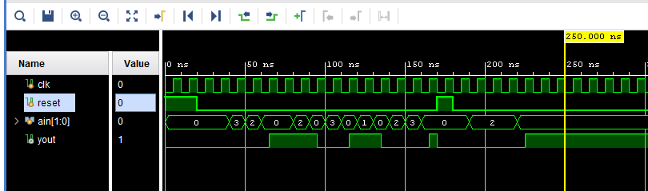

#### Implementation

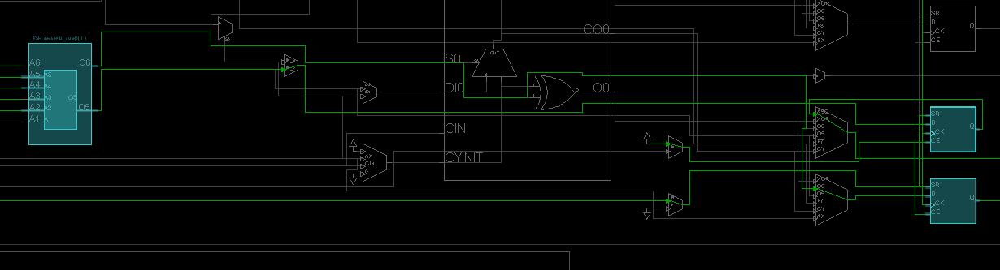

#### Prompt

 output depends only on the present state and not dependent on the input

## 10-3-1 mealy_ROM

#### Verilog Code

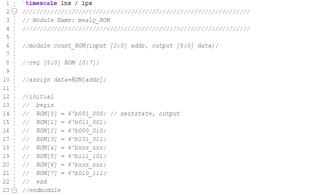

#### RTL

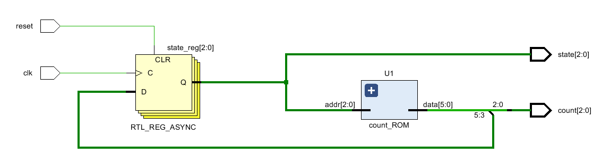

#### Simulation

#### Implementation

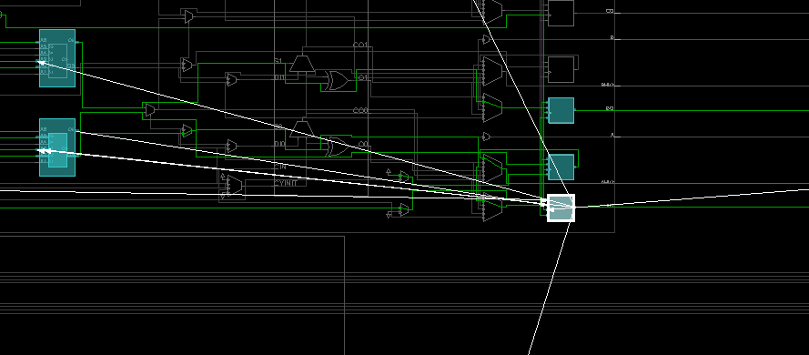

#### Prompt

behavioral modelling used. counting sequence is 

000, 

001, 

011, 

101, 

111, 

010 then start over.