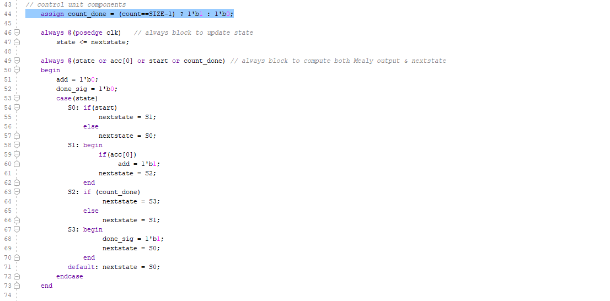
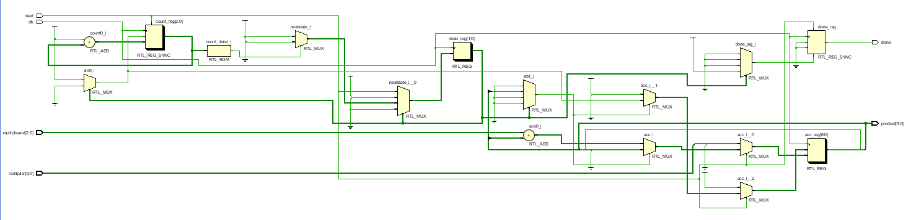
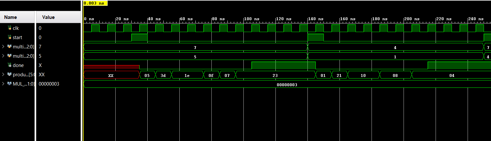

# Lab 11_ Finite State Machine

## 11-1-1

#### Verilog Code

#### RTL

#### Simulation

#### Implementation

#### Prompt

3x3 multiplier with 6 bit output. SW0  is starting(load) the multiplication.

## 11-1-2

#### Verilog Code

#### RTL

#### Implementation

#### Prompt

SW7:SW5 as a multiplier and SW4:SW2 as a multiplicand and BTNU is the load.

## 11-1-3

#### Verilog Code

#### RTL

#### Simulation

#### Implementation

#### Prompt