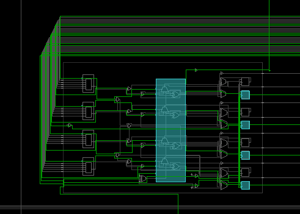

# Reusable BCD hex 7seg Display Code

The  HexToBCD algorithm in the last lab worked for one hex group. The problem is that it needs to be extended from 4 bits to 32 bits. Decoders, clocks and counters need to be added. The goal is to get that done here.

Figure out what a decoder does. Explain in the testing.

## 0Decoder

#### Port Diagram

#### Verilog Code

#### RTL Schematic Screen shot

#### Synthesis Schematic Screen shot

#### Implementation Device screen shot zoomed in on something interesting

Nothing new .. just a LUT

#### Testing

Decoder changing 3 inputs into 16 output. 

___

#### Prompts 

*What does ~| mean in front of the X?* **X is three bits. Or all the three bits together.** 

*How many decoder circuits does this code build?* **2 .. one with gates, and one with a shift to the left  a certain number of bits.** 

*Which verilog command(s) construct the RTL decoder?*  **assign z = 1 << x;** 

*What RTL construct do we think of instead of a decoder?*  **shift register**

## 1_32bitCounting

This code tests the ability to count clock pulses and display 32 bits split into two groups of 16. SW[0] switches between the two groups. 

#### Port Diagram

#### Verilog Code

#### 

#### RTL Schematic Screen shot

#### Synthesis Schematic Screen shot

#### Implementation Device screen shot zoomed in on something interesting

First Flip Flops Being Used, 

Carry Logic Being used

#### Testing

3 

___

#### Prompts

**The** Nexys4DDR goes at 100,000,000 cycles per second. FFFF FFFF bits HEX  is  4,294,967,295. 
*Approximately how many seconds would there be between starting to count over again at 0?* 4,290,000,000/100,000,000 = 42.9 seconds
*Approximately how many seconds would it take the last bit to change?* **FFF FFFF is 268,435,455 decimal so** 
**268,000,000/100,000,000 = 2.68 seconds**
*Approximately how many seconds would it be visible?* 
**42.9-2.68=40.2 seconds**

## 2_bitSlicing

The goal  is to find a way to grab 4 bits out a group of 32 in a single line of code.  This technique is called bit slicing.  This is similar to slice or split in other languages.  

#### Port Diagram

#### Verilog Code 

#### RTL Schematic Screen shot

#### Synthesis Schematic Screen shot

#### Implementation Device screen shot zoomed in on something interesting

Four Luts are used to handle the multiplying asked for in the bit slicing.

#### Testing

3 Select bits select 1 of 8, 4 bit groups from a 32 bit constant and display on LEDs.  The constant is inside the port diagram:

------

#### Prompts

Slicing or Slitting is part of a number of languages including  [python](https://www.programiz.com/python-programming/methods/built-in/slice) , [matlab](https://stackoverflow.com/questions/11318724/matlabs-slice-function-not-working-as-desired), [perl](https://perldoc.perl.org/functions/split.html) and is a common concept name to use when searching for something similar in other languages [C](https://stackoverflow.com/questions/14618342/copying-a-subset-of-an-array-into-another-array-array-slicing-in-c), [regular expressions](https://stackoverflow.com/questions/35578470/how-to-slice-characters-from-string-using-regex). *Is slice or split a concept or syntax in verilog*? Concept.

In the SystemVerilog standard [IEEE_Std1800-2017](https://github.com/ENES-246DigitalElectronics/ENES247/blob/master/IEEE_Std1800-2017_8299595.pdf) (released in Feb. 2018), search for "+:" . *What section, sub-section, sub-sub section ... etc. is this documented .. and how is this described?* 

7. Aggregate data types
   7.4 Packed and unpacked arrays
   7.4.3 Operations on arrays
   ​	— Reading and writing a variable slice of the array, e.g., A[x+:c] = B[y+:c]

Suppose this test didn't work. You would then go to the Xilinx's reference called [ug901-vivado-synthesis.pdf](https://github.com/ENES-246DigitalElectronics/ENES247/blob/master/ug901-vivado-synthesis.pdf) which is randomly updated.  *What page is "+:" found  that is not in the middle of code and how is it described?* 

On page 222 in Dec. 19, 2018 version of ug901 is described as  "Variable Part Selects Verilog Coding Example".

*Given that the "+:" symbol appears in Xilinx documents as well as the standard, what percentage confidence do you have that this will synthesize in Vivado?* 

90% confident .. it has worked in the past. No reason for it to stop working now.

Look at this chart describing the growth of Verilog/SystemVerilog. The 2017 standard, reportedly did not add any new functionality to the 2012 standard. *The "+:" concept is actually listed on this chart. What is it's name?*  [Variable part select](https://www.google.com/search?q=verilog+variable+part+select&rlz=1C1CHZL_enUS735US735&oq=verilog+variable+part+select)

*Given that it is part of the older Verilog standard before it merged with SystemVerilog, how confident are you now that it should work?* 100%

The 2017 standard, reportedly did not add any new functionality to the 2012 standard. *How relevant do you think [this document](http://sutherland-hdl.com/papers/2013-SNUG-SV_Synthesizable-SystemVerilog_paper.pdf) (that the graphic from above came from) is?* Very relevant

*The word "design" above means the code will work where in the Vivado workflow? (Simulate, RTL, Synthesize, Implement, Bitstream)* Synthesize. 

*The word "verification" above means the code will work where in the Vivado workflow?* Simulate. 

*How does the IEEE_Std1800-2017 describe these two parts of SystemVerilog?* The same way.

## 3_32bitHexToBCDto16LEDs

## Design Flow: 

Starting point is this [algorithm](https://pubweb.eng.utah.edu/~nmcdonal/Tutorials/BCDTutorial/BCDConversion.html).  This is tested in the StartingPoint project. 

### Outlining the starting point algorithm:

Create 4 bit registers for the BCD output called 100s, 10s, 1s for a total of 12 bits.

​	Hook up 8 switches to 8 input bits named binary (HEX)
​	Hook up the BCD groups of four bits to LEDs

​	Set all BCD bits to 0.

​	step through the Hex bits 
​		if BCD output (in any 4 bit group) is greater than 5, add 3
​		shift BCD Left with MSB to the right shifted into the next BCD 4 bit group to the left
​		shift the binary digit into the 1s least significant. 

​	Test with 12 LED's.

### Outlining an Extended Algorithm:

There are two approaches, adding Thousands, Ten_Thousands, Hundred_ Thousands, Millions, etc. 

A second approach is to nest  one for loop inside another. There is no reason this could not be done. The result would be the same combinational circuit.  The code may be harder to understand 
Here is outline of the code

So make BCD one 32 bit integer, initially 0.

For each bit in HEX
​	For each 7seg display (8 in our case)
​		Split the BCD into an associated 4 bit group
​		Add 3 to the group if larger or equal to 5
​	Shift entire BDC left, putting Hex bit in the LSB of BCD

So the big difference in this extended algorithm is taking the repeating pattern in the starting code and nesting it in a for loop within a for loop. 

The trick is going to be splitting the BCD group into an associated 4 bit group. But we already practiced how to do that!

### Testing the Extended Algorithm:

Hex is a more compacted way of storing a number. BCD takes Hex and spreads it out over more digits.  These screenshots of a Windows computer calculator in programming mode illustrate this. This first one maxes out 32  bits hex.  It would require 10 sevenSegDisplays to display BCD.

This next one would require 9 sevenSegDisplays. The Hex value looks random or arbitrary.

This requires 8 sevenSegDisplays. So our maximum Hex input is 28 bits. The result will be BCD 32 bits. 

Test the starting point code, and then write the extended code and document it here. 

#### Port Diagram

#### Verilog Code

#### RTL Schematic Screen shot

#### Synthesis Schematic Screen shot

#### Implementation Device screen shot zoomed in on something interesting

#### Testing

----

Prompts

## 4Clocks

#### Port Diagram

#### Verilog Code 

#### RTL Schematic Screen shot 

#### Synthesis Schematic Screen shot

#### Implementation Device screen shot zoomed in on something interesting

Can see flip flop being used for the first time:

#### Testing

All can do is watch it count or reset.

---

#### Prompts

With interlacing, monitors can run as slow as 25Hz but some people see a flicker. Without interlacing, monitors have to run at twice that speed .. 50Hz. In the US, these numbers are 30Hz and 60Hz to match the AC wall outlets. Gamers want refresh rates above 144Hz. Cheap GUPs are running 80Hz depending upon the game.  *At what speed are the three LED's representing the future 8 7segDisplays refreshed in this clock plan?*  100,000,000/5,000,000 = 20Hz 

*Should you see any of the three anode_small LED's flicker?* Answer depends upon age, eyes, brain. 

Suppose someone complains that they see a flicker once this code is starts driving 7seg displays instead of LEDs. *What would you change the anode_divider value to?* Something smaller than 5,000,000.

Suppose that someone complains that the 7seg (or LED) displays are too dim or vary in brightness.  *What would you do?* Decrease the refresh rate. 

*Given that the clock is 50% on and 50% off, why would the refresh rate of the 7seg displays or LEDs change brightness?*  LED's or segments have a turn on time. Brightness varies initially. After passing the turn on time, brightness will only vary with the voltage applied. 

*At what speed is the counting going on?* 100,000,000/50,000,000 = 2 Hz. New count every half second.  

## 5_32bitsHexTo7seg

This is working! Goal is to figure out how to use it in future labs.

#### Port Diagram

#### Verilog Code

#### RTL Schematic Screen shot 

#### Synthesis Schematic Screen shot

#### Implementation Device screen shot zoomed in on something interesting

 Lots of stuff going on

Lot more flip flops being used to count, remember things.

------

#### Testing

Left most switch[15]  pauses the counting.
Switch[14] resets to 0, pausing on a random segment
Switches 0 through 2 control the decimal place. 

------

#### Prompts

*What does the utilization report look like?*

*Which* *counter would you delete if another program was controlling the number to be displayed? Cut and paste a picture of the code that would be deleted in order to do this.*

*What 32 bit variable name that you would add as an input to this module, and connect it to a top level with something to display? (Hint right now it is seeded with a constant.)* c_input

*Are clk, reset, stop_start, count_clk, divider_counter needed if the counter clock is removed?* clk is still needed. Everything else will not be mentioned in the code if the counter clock is removed. 

*What will have to be changed if the 32 bit Hex to BCD code is added?* c_input will be feed into the hex to BCD circuit, the output of the circuit will require modification of the //hex selector circuit, replacing c_input. 

*What variable controls how fast the counting is done?* divide_counter.

*To slow down the counting, what would need to be done ... make the number larger or smaller?* Larger. 

## 6_32bitsHexToBCDto7segAnd16LEDs

Add your 32bitHextoBCD code to the above project. Replace any of the modules that you see with more attractive code. Add comments that make it easier to understand. 

#### Port Diagram

Verilog Code

This is the top level module.

This is Binary to BCD module.

#### RTL Schematic Screen shot

#### Synthesis Schematic Screen shot

#### Implementation Device screen shot zoomed in on something interesting

Still using less than 1% of the FPGA resources. 

This is getting increasingly useless. It is good for looking at data_paths, but not control_paths. Need to start looking at timing diagrams. 

It is beyond the scope of this class to look at a timing report.

#### Testing

Turn it on and it starts counting. Right 3 switches control decimal place. Left three switches from left to right control pause, reset and binary/BCD switch. Is display upper 16 of both binary and BCD.  Bits 27:0 of the binary are turned into 31:0 of BCD. It is hard to relate them when looking at the upper 16 bits of each.

Can tell that the middle segments count a bit faster in BCD because the center of the display is shift right to where the binary is counting more quickly one segment.

Switching back and for, can see that the same underlying number being counted is used in both displays.  

------

#### Prompts

*What are some next steps?*

The LEDs are glowing a little bit like intermediate calculations of the HEX_BCD module are leaking onto the display. This will happen if o_DV causes the top level module to look at more than just the results of the HEX-BCD module. It looks like the LED's turn on faster than the segments because they are black. Does the same top level module code drive them both?   A timing diagram of the control_Paths in the top level module needs to be examined.  Suggest start with ASMD chart of the top level module.  

The leading segments need to be blanked rather than display 0 .. depending upon where the decimal is placed. 

Roll over at the top is working in HEX. Appears to work in BCD. To build confidence, need to be able to switch to the lower bits and slow the counting way down. This probably the only time can visually check whether the HEX is being translated to BCD. 

The roll over is in hex, not BCD. This means that when the hex rolls over, the BCD will stop at some place and randomly starting over again at 0. Most of the time never see this because BCD rolls over 16 times as HEX counts through 4 extra top bits. But the last time HEX rolls over, BCD might stop and roll over at a lower number. This will not happen if HEX rolls over through hex FFFFFFFF, but any other number it rolls over at will cause this glitch in the BCD. 

Add another input to the top level module to switch to 60, 60, 60, hundredths .. for a stop watch.  

There are colon segments in the displays that may be connected to the FPGA, but not documented in the XCD file. First see if they light up with a power supply.  Use a Nexys 4 DDR board that is partially working for this. Chase some traces with ohm meter.

Rewrite BCD module in nested for loops and add to the top level module. 

## 7_32bitsHexBCDdata_path

This lab is working perfectly. Has the first next step done in it. 