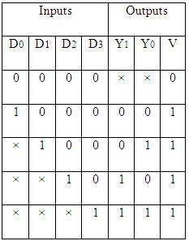
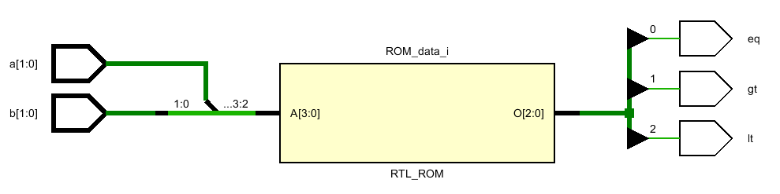
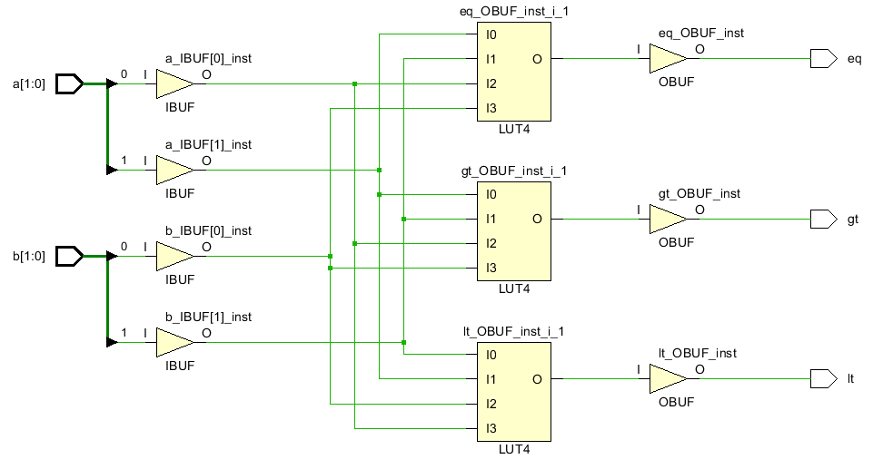
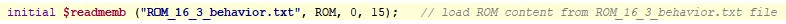
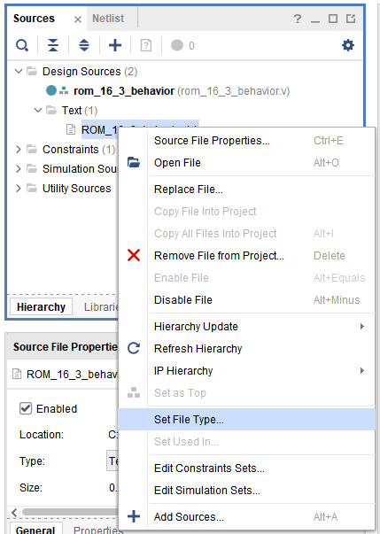

## 1Lut_Mux

One goal might be to use the primitives within the FPGA CLB. Chapter 3 of the Vivado 7 Series Libraries  lists off the primitives. Chapter 4 describes how to implement them using VHDL and Verilog. Explore the LUT and MUX in this project. 

#### Port Diagram

#### Verilog Code

#### RTL Schematic Screen shot

#### Synthesis Schematic Screen shot

#### Implementation Device screen shot zoomed in on something interesting

#### Testing

 Converts HEX F003355FF to binary. Converting from left to right. 

___

#### Prompts

*Does it look like the primitives can be accessed in Verilog?* **Yes.**

*Can you see a direct relationship between the primitive used and the primitive referenced in the Verilog code?* **Yes. One of them is uses buffers.**

*The Mux implementation leaf cell seems to highlight a vertical path within the CLB. Why?* **they represents switches.**

*How is the LUT instantiation different from the normal instantiation of calling a pre-existing module ?* **sets inputs in the code.**

*What Line of the Code puts a truth table in the LUT?*

**LUT6 #(.INIT (64'h0000000F003355FF)) selection_lut ( .I0 (data_in[0]),.I1 (data_in[1]), .I2 (data_in[2]), .I3 (sel[0]), .I4 (sel[1]), .I5 (sel[2]), .O (lut_data_out))**

*How many rows are there to the truth table?*

**64**

*How is the LUT instantiation different from the normal instantiation of calling a pre-existing module?*

*Look through chapters 3 and 4 of the Vivado 7 Series Libraries.  Focus on the Design Entry Method box.  Then answer these questions.*

*What does instantiation mean?*

**sets initial value**

*What does inference mean?*

**conclusion from evidence.** 

*Have we inferred buffers (BUFG) in projects before?*

**Yes.**

*Verilog has tristate [buffer primitives](http://verilog.renerta.com/mobile/source/vrg00003.htm)  named bufif0 and bufif1. These names don't appear in the Vivado 7 series libraries. Why? What are the risks of using the buffers Xilinx has named in this document?*

*Look up LUT6 in the Vivado 7 series library document. We instantiated it in this project. Is Instantiation possible according to the document?*  **Yes.**

*What is the preferred design entry method?* 

**logic table**

*Is MUXCY in the Vivado 7 series library document like LUT6?* 

**No.**

*We instantiated MUXCY in this project's verilog code. And it looks like it was successfully implemented. We can test it. Read this [article](https://forums.xilinx.com/t5/Welcome-Join/where-are-the-muxcy-and-xorcy/td-p/311931) from from Jan 2013 about MUXCY and XORCY. Do you think it is wise to use this piece of a CLB in a circuit design project?*

**Yes.**

*What would you guess is the preferred entry method for a MUXCY .. if it existed in the Vivado 7 series library?*

**Vivado 7 series.**

*Why do you think Xlinix still supports MUXCY (because we used it!), yet don't document it?*

**probably because to have fast carry speed function.**

*Xilinix was the [first FPGA vendor](http://hardwarebee.com/list-fpga-companies/) to start shipping LUT6 FPGAs. Intel FPGAs come from purchasing Xilinx's major competitor for years .. and ships a LUT6. How does [Flex-Logix](http://www.flex-logix.com/6lut-faster-denser/) fit into this competition?*

**They are similar to the Xilinix.**

*Why is this question important to you, the college, the market place?* 

**because this is going to be future technology.** 

*What does [Flex-Logix name it's equivalent](http://www.flex-logix.com/dsp-applications/) of LUT6?*  

**GEN 2 EFLX**

*Is the code on this [web site](http://www.flex-logix.com/dsp-applications/) verilog or it's competitor VHDL?*

**verilog.** 

*What class at HCC teaches you what a [FIR](http://www.flex-logix.com/dsp-applications/) is?* 

**don't  know.**

## 2Decoder

#### Port Diagram

#### Verilog Code

#### RTL Schematic Screen shot

#### Synthesis Schematic Screen shot

#### Implementation Device screen shot zoomed in on something interesting

#### Testing

3 inputs converts to 16 output. 

___

#### Prompts 

*How many of the outputs of the Decoder are positive at any given instant in time?***2**

*When the Decoder changes it's output, what happens among these choices

1. *Do all outputs go to 0 before the next set of outputs are displayed?* **yes** 
2. *Do the new 1(s) appear along with the previous 1(s) simultaneously?*:***yes**
3. *Does/Do the output(s) flicker in some unknown way based on impurities or differences in the fabric of the FPGA?* **yes they flicker.**
4. *Do we have the tools to figure out what the answer is?*	**No**

*Given the concept of an [infinitesimal](https://en.wikipedia.org/wiki/Infinitesimal), is it ever possible for two outputs, from any circuit to change simultaneously?*

## 3PriorityEncoder

A encoder is different than a mux in that there are no select lines. Only one input out of all the inputs coming in is expected to be a 1.  So what happens if more than one input is a 1? Priority is assigned. For example, which child of all your children get's your attention if all are yelling at you at the same time? You have to choose. 

In hardware, it is the outputs of other circuits that need attention. One circuit finished multiplying and the output needs to be transferred somewhere else so it can begin the next multiply. Meanwhile the keyboard circuit has taken the x and y coordinates, has detected the key is stuck, has stopped repeating the key, is beeping the user and needs to trigger software that displays a message on the screen "key stuck." Which takes priority if both are asking for CPU attention at the same time?   

To deal with more than one input, the designer has to deal with two issues:   
What is the priority order?

What is the difference between the 0 net of the bus having a 1 on it asking for priority and silence .. nobody asking for priority? 

It is a tricky, logic problem. Look at the first two rows of the truth table below. The first row is where none of the inputs are asking for attention. V=0 because Y1 and Y0 could be anything ... notice that the truth table is only 5 rows long. With four inputs, it could be 16 rows long. 

There four vivado projects. There are three different verilog expressions introduced. The first synthesizeable verilog code has been introduced. Do one port interface diagram. Do four Verilog code screen shots and four screen shots of everything else. The goal is to compare them.  Just describe how the three test below.

#### Port Diagram

#### Verilog Code

#### RTL Schematic Screen shot

#### Synthesis Schematic Screen shot

#### Implementation Device screen shot zoomed in on something interesting

#### Testing

SW7 is the priority. when it is off the other inputs are doesn't care. SW7 makes sw6 care and this goes on until sw0 by line.  SW7 is the reset also cause when it is off it gets back to initial value. 

---

#### Prompts

*How is the gate verilog code different between AllThree and Gate?* 

*The first synthesizable System Verilog commands have been introduced. How can you tell by the source verilog file extension?*  **.sv extension means it  is synthesizable.** 

**Where in the verilog "new project sequence of steps" are you given the option of creating system verilog or just plane verilog?*

 **system verilog.**

*In what way does the DataFlow implementation use the if command?* **inside of a loop to assign a condition**

*In AllThree, why would always @* work ... in addition to always_combo?* **@ is for specific group  of codes while always_combo for different groups.**

*In System Verilog, what are the other two always commands?* 

*From a design point of view, which implementation of a priority encoder do you think Vivado expects engineers to ask it to implement?*  **data flow.**

*Which implementation of a priority encoder looks like the easiest to spot and see within a much much larger chunk of verilog code?*  

*Which is probably the most sustainable (will be supported by vendors in the future, future engineers looking at the code will understand it)?*  **dataflow code.**

*Which will be the easiest to change/modify?* **I believe dataflow.**

*We have been told that implementation within the FGPA doesn't matter from a net and leaf cell count point of view. We don't see obvious controls that specify where within the chip everything is implemented. (It looks like resources next to the switch and LED pads are being used constantly.) But real quick in the future, speed is going to matter. Which of these priority encoder looks like it will be the fastest?* **oneHot**

*Why is speed not important to us right now?* 

*Why is the for loop called [One-Hot](https://en.wikipedia.org/wiki/One-hot)?* 

An alternative to if, if, if, if, if, ... if else is a case command. Both Case and If else Case command syntax was part of verilog.  This is why it is called "data_path". *Why do you think the if if if ...if else command introduced with System Verilog?*  

## 4ROMpattern

#### Port Diagram

#### Verilog Code 

#### RTL Schematic Screen shot

#### Synthesis Schematic Screen shot

#### Implementation Device screen shot zoomed in on something interesting

#### Testing

ROM is a combinational component for storing data. text file in the lab4 file is the  one deciding the output. when we change it, it also changes.

___

#### Prompts

This program grabs data in a text file and puts it in ROM. There are several questions here. First this line in the verilog code just generates error messages. 

Google found [this](https://forums.xilinx.com/t5/Synthesis/Pathnames-for-Verilog-readmem-Datafiles-for-synthesis-Warning/td-p/775824) in response to typing in the error message.  *How many solutions to the problem are in the Xilinx user forum post?* **1** 

*Describe the solution that works in words:* 

*When is the file read by vivado (RTL analysis, synthesis, implementation or bitstream? )*

*What does this tell you about the file's sustainability (easy to identify, easy to modify, easy to find)?*

**easy to identify**

*After following the forum's post, what is the path to where the file actually lives?*

**with the .v file**.

*After synthesizing, where in a CLB do the contents of the text file go?* 

**inside the LUT**

Look at the .txt file. 

*How many bits per row?* **3**

*How many rows?* **16**

*Why so many rows?* **4 input 2^4=16**

*What do the bits in the text file represent?*

**the outputs.**

*A [Mips CPU](https://en.wikipedia.org/wiki/MIPS_architecture#Jump_and_branch) contains a circuit similar to this. When does the circuit execute?*  

## 5ROMmultiply

Your goal is to create a circuit that multiplies two bits together. Use the ROM. Create the text file. Create the code. Make it as RTL as possible. 

#### Port Diagram

#### Verilog Code

#### RTL Schematic Screen shot

#### Synthesis Schematic Screen shot

#### Implementation Device screen shot zoomed in on something interesting

There was no any wire connections.

#### Testing

So this is a 2 bit multiplier. 

___

#### Prompts

I created this by changing the txt file and created for results of 2bit multiplication results. biggest that the result can reach is 4.

