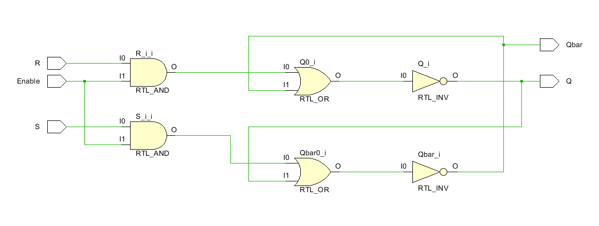
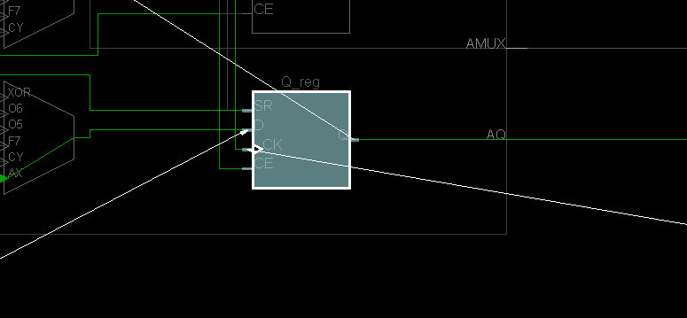
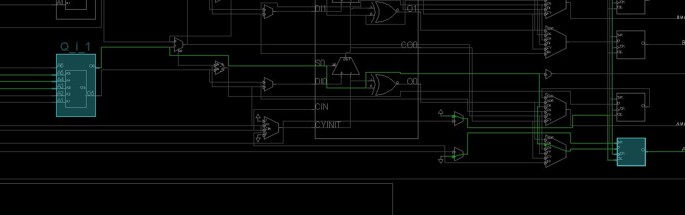

## 5 Latches and Flip Flops

Create these labs. Just do an RTL-schematic screen shot and something interesting device screen shot. Test them.  Copy all the bit files to a single folder so they can be demonstrated quickly all at once. 

The text associated with them is a pdf called Lab5. Figure out what points the text is making and create prompts in your lab notebook for yourself.

Lab5_1_1 is working. 
Labs 5_1_2 and 5_1_3 have a  file called "lab5_prehook". But the single line in this file in the xdc file. 

The major take away from this lab is using the tb_bench and understanding what a synchronous reset is. In the future we are going to be letting Vivado choose when to use a flip flop, not directly using them. 

## **Lab 5_1_1** - SR Latch

### Verilog Code

### RTL-schematic

### Synthesis

### Implementation

#### Prompt

Building SR latch by using dataflow. So we can compare with gate way SR latch in next phase.

## Lab 5_1_2 - SR Gated Latch

### Verilog Code

### RTL-schematic

### Synthesis

### Implementation

#### Prompt

Gate level coding. In this one the behavior is selected by gates however in the dataflow, implemented by specifying the data flow

## Lab 5_1_3 - D Latch

### Verilog Code

### RTL-schematic

### Synthesis

### Implementation

### Prompt

We coded D latch that has only one input and one enable. when enable is off, the input doesn't work and there is no metastable output in this D latch.

## Lab 5_2_1 - D FlipFlop Behavior

### Verilog Code

### RTL-schematic

### Synthesis

### Implementation

### Prompt

Designing D flip flop. code clearly shows that There is only one input and clock triggered only on positive edge.

## Lab 5_2_2 - Circuit

### Verilog Code

### RTL-schematic

### Synthesis

### Implementation

### Prompt

First part of the code makes Qa triggered by the input

second part of the code make Qb triggered by positive edge (which is when clock thick input switch is up)

Third part of the code make Qc triggered by negative edge (which is when clock thick input switch is down)

this is for see the difference between the positive edge,  negative edge and the input triggers.

## Lab 5_2_3 - D FlipFlop sync reset behavior

### Verilog Code

### RTL-schematic

### Synthesis

### Implementation

### Prompt

Reset and input triggered by the positive edge of the clock. Reset is on then the LED turn off. if only D input is on then Q is 1 and LED turn on.

## Lab 5_2_4 - D FlipFlop with CE and sync reset behavior

### Verilog Code

### RTL-schematic

### Synthesis

### Implementation

### Prompt

This is basically same with previous phase except this time there is a clock enable. when clock enable is off the clock pulse doesn't work.

## Lab 5_2_5 - T FlipFlop enable behavior

### Verilog Code

### RTL-schematic

### Synthesis

### Implementation

### Prompt

T input changes the input every time negative edge pulses comes from the clock. Since it is negative logic reset the code makes that reset work when it is 0 instead of 1. So the reset has to be 1 so it will be deactivated. (code: if(!reset))

