# Lab 6

## 1-1 4 bit register with synchronous reset

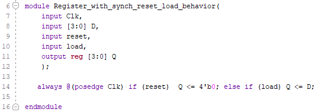

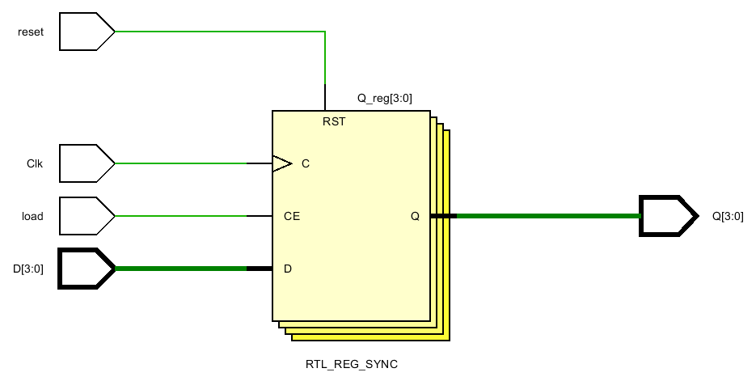

D flip flops differ in the bottom label. This one says RTL_REG_SYNC.

*Why is the load line connected to CE and the reset line connected to RST? Just because of the order in the if command?* Yes

#### Testing

Load is working as clock enable.  And code shows that clock only works at positive edge.

**Prompts**

## 1-2 Register with synch set reset load behavior 

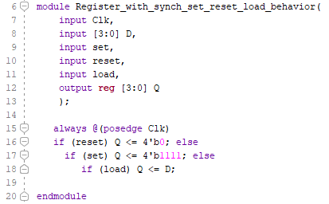

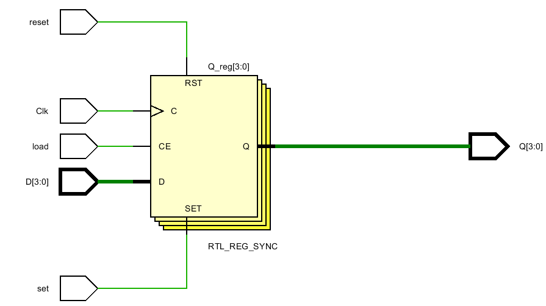

*So there are three ways to control the register, RST, SET and load. And they have to be in the nest order of those if commands. This is strange .. but it makes it easier to remember. First Reset, then Set, then Load. What does Load do? What is CE?*

#### Testing

 Load is clock enable again and clock works at positive edge. set makes all outputs 1 and reset makes every output 0. when D's are 1 the positive edge ticking making LEDs light. 

**Prompts**

What happens when set and reset are on at the same time? **work as reset**

## 1-3 One Bit Delay

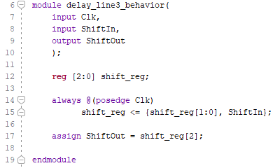

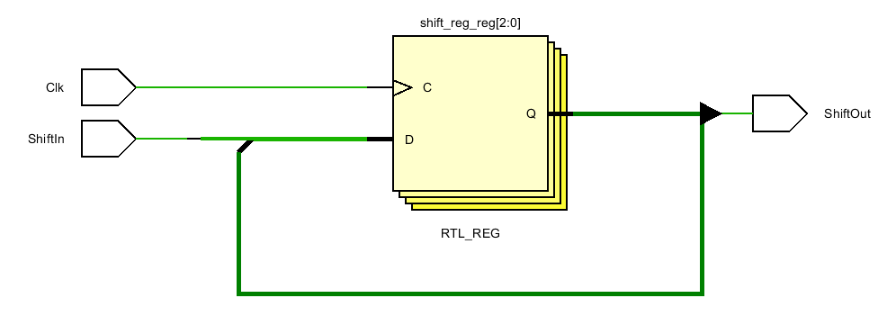

*The { } command above is where the shift occurs. Why not use >> or << ? Does it still work?* It normally shifts in 0's. To shift in ones, have to not, then shift, then not back. Also << shifts in more than one bit which would either be multiple 0's or multiple 1's, not a mixture. It's use is limited.

Why is this named RTL_REG rather than RTL_REG_SYNC like the ones above?

#### Testing

This is 3 bit delay cause it needs 3 clock ticking to input go to the output.

**Prompts**

Why it is 3 bit delay? **code shows that reg[2:0] shift_reg**

## 1-4 ShiftLeft

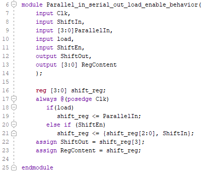

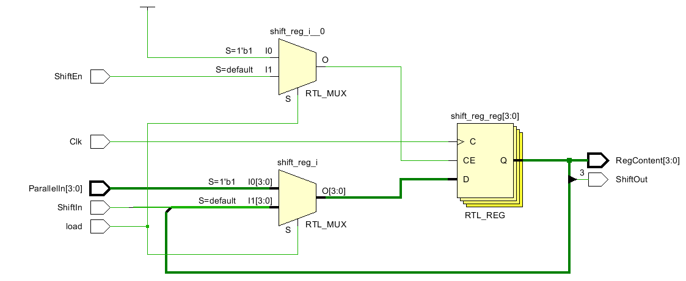

Again, we see RTL_REG.  *What is the difference between RTL_REG and RTL_REG_SYNC? Are we going to see a RTL_ASYNC?*

#### Testing

Shiftin and ShiftEn doesn't need load for sending input in. ShiftEn turnoff one by one and ShiftIn turning on turning on one by one. 

**Prompts**

What does Load do in this one. **Work as selection**

## 1-5 Serial in parallel out enable behavior

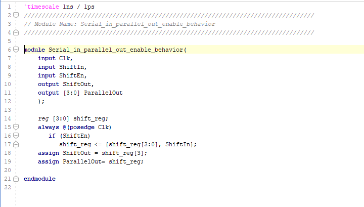

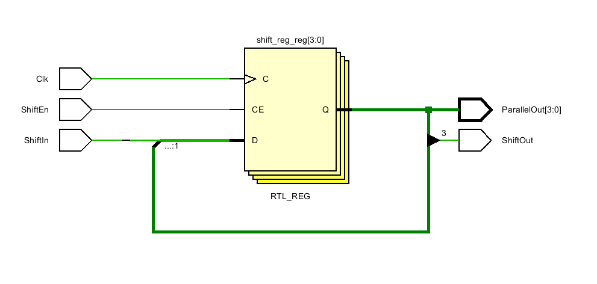

#### Testing

ShiftEn work as clock enable.  When it is 1, the clock ticks shift input from shiftin to the left until the shift out is on.  

**Prompts**

### 2-1 Eight bit counter with T flop behavior

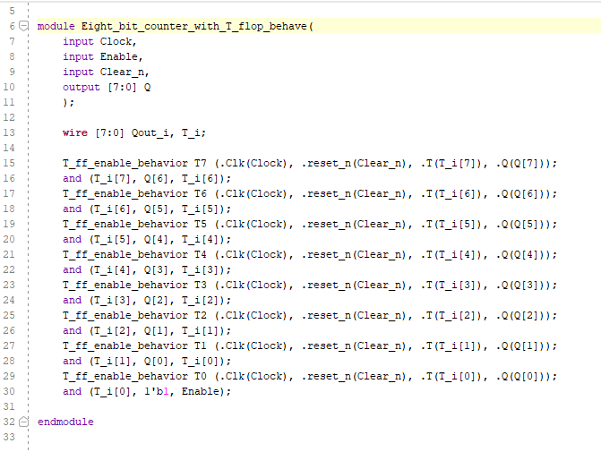

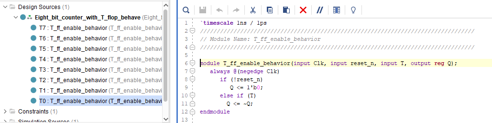

### RTL Schematic

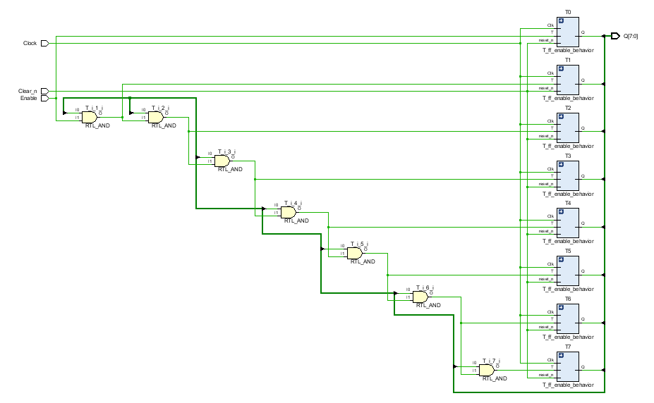

### Implementation

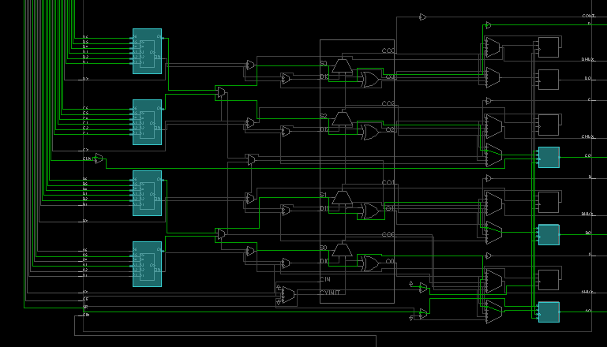

**Prompts**

what does (.) meanning? **(.Clk(clock) '.' in here means for instantiation. So in the code we create 7 T flip flop circuit in the main circuit. T7, T6,..etc these are only names for the classes under the main code and when we change the name in the main circuit they changed in the classes too. The code instantiation has to be in the same order with the main circuit variable assignment. We are creating 8 bit counter with 8 T flip flops.**

### 2-2 Eight bit counter with D flop behavior

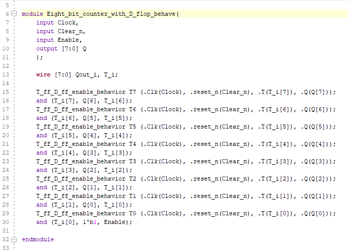

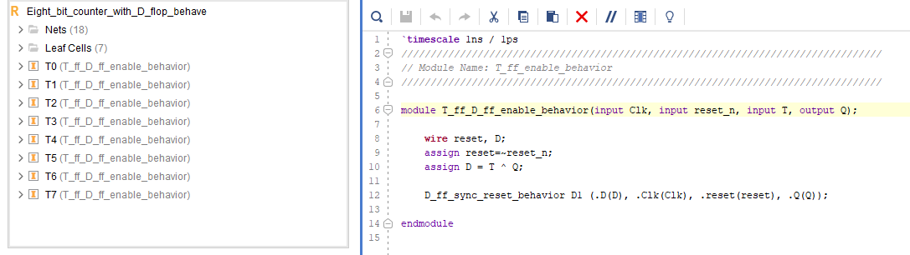

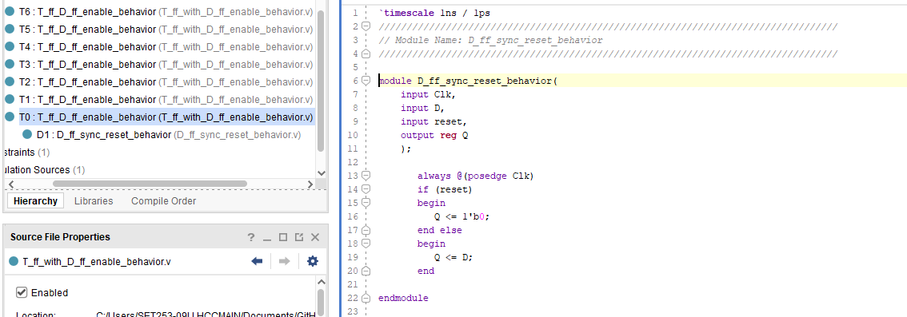

### RTL Schematic

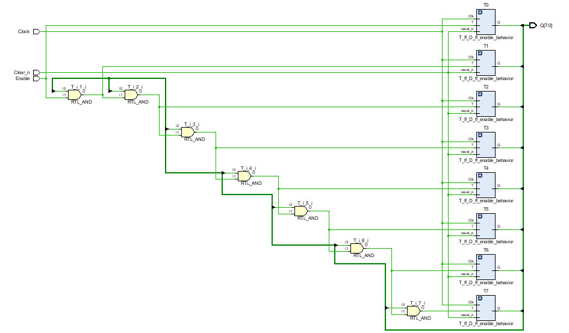

### Implementation

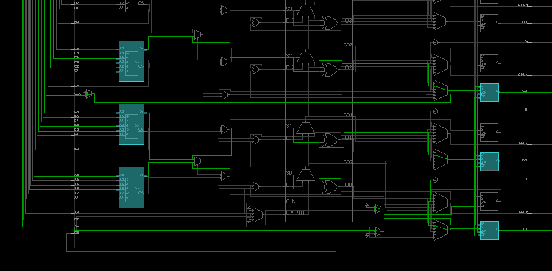

#### Testing

This is the same as previous one except  this one is using D flip flops with same type  of coding style.

### 2-3 Four bit down counter with load enable behavior

### RTL Schematic

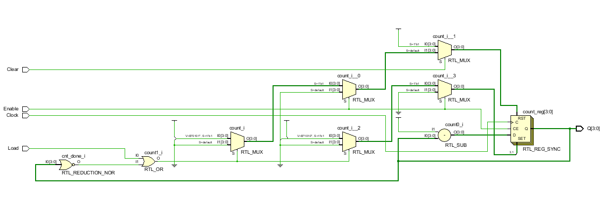

### Implementation

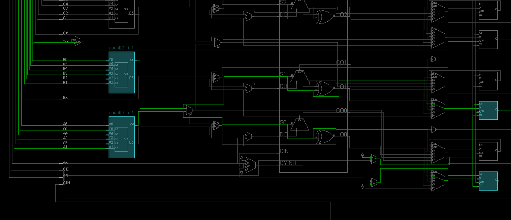

#### Testing

4 bit count down. Counts down from 10  to 0 by each clock ticking. Enable has to be 1 and when load is on it sets counter back to 10 and clear sets count to 0. If Load and Cleat are 1 at the same time then it work as clear.

**Prompts**

what is the difference with the previous one? **Using D flip flops instead of T flip flops**

