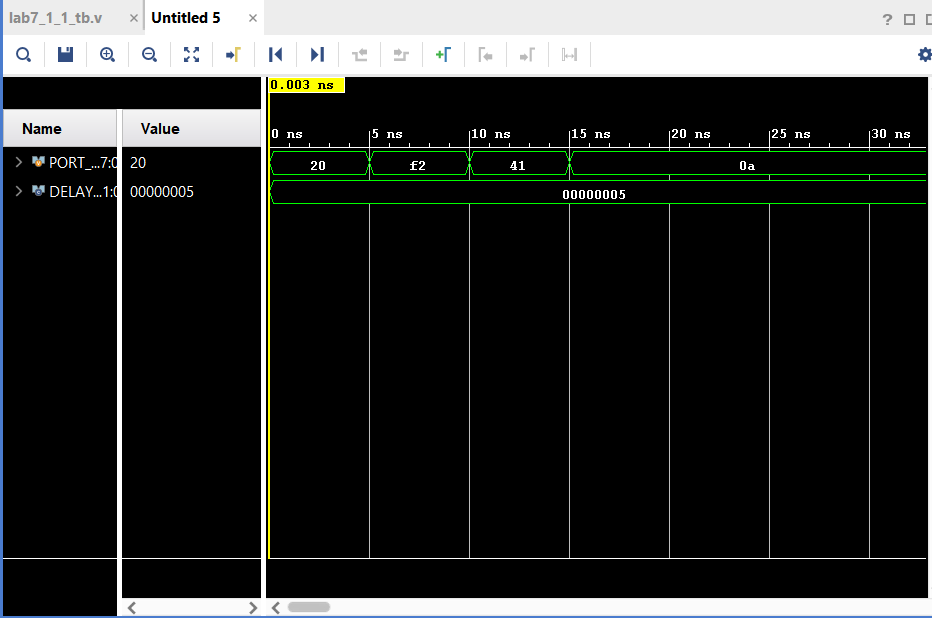
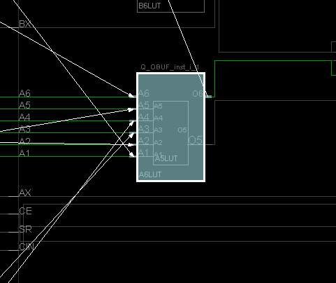

[For Loop Pipelining example](https://www.xilinx.com/support/documentation/sw_manuals/xilinx2015_2/sdsoc_doc/topics/calling-coding-guidelines/concept_pipelining_loop_unrolling.html)

# lab7_1_1

Code:

Simulation:

#### Prompt:

**When blocking statement is on, it won't show the rest of the codes. However in this situation codes have #DELAY which output  shows them in a line that same with the verilog  code.**

What happens is you delete #DELAY PORT_A? **It will start the process same time with the first code.** 

# Lab7_1_2

#### Code:

Simulation:

Prompts:

STREAM is a wire and in this coding 

What does STREAM = #10 1'b0;
          STREAM = #2 1'b1; mean?

**this code shows it will wait 10 seconds first then it will be 0. then it will wait 2 seconds then it will be 1.**

**Lab7_1_3:**

**Code:**

Simulation:

RTL Schematic:

Synthesis:

Implement:

**Prompt:**

We created mux with if-else statement. So statements worked for depends on which selection is chosen.

 what does if(sel==2'b00)
            Q = channel[0];
		else if (sel == 2'b01)
            Q = channel[1]; do?

**first code couple means if first select 0 then the channel 0 input will light the LED. if select turn on 1 then the channel 1 will light the LED.**

# **Lab7_1_4**

**Code:**

#### RTL Schematic Screen shot

#### Synthesis Schematic Screen shot

#### Implementation Device screen shot zoomed in on something interesting

#### **Prompts**

Where does the default condition is selected? **invalid=1'b1** 

What is this coding style similar with? **It is similar to the ROM lab. that we were selecting output by txt file**

# **Lab7_1_5**

**Code:**

#### Simulation

#### RTL Schematic Screen shot

#### Synthesis Schematic Screen shot

#### Implementation Device screen shot zoomed in on something interesting

#### **Prompts**

It is counting from 000 and goes 001 011 101 111 010 .

