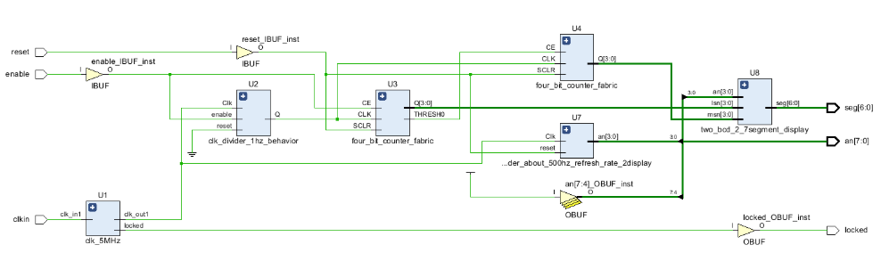

# lab8_1_1

#### Verilog Code

#### RTL Schematic Screen shot

#### Synthesis Schematic Screen shot

#### Implementation Device screen shot zoomed in on something interesting

#### Prompts

First I changed the clocking refresh rate to 5 MHz cause the circuit works between 4 and 800 MHz. when it is 5 Mhz the divider is 22 bit and count [22:0] shows it is the divider and it comes around 1 seconds. The circuit is giving signal every second through output when enable is on.  

How to change the refresh rate? **From Ip catalog and in the fpga features and clock wizard. In the clock outputs.**

# Lab8_1_2

#### Verilog Code

#### RTL Schematic Screen shot

#### Synthesis Schematic Screen shot

#### Implementation Device screen shot zoomed in on something interesting

Prompt

What does the circuit do? I**t is displaying inputs adding to the 7 seg display with 500 Hz rate.**

How does it change 5MHz to 500 Hz? **with the divider which is reg[12:0] count code.**

# Lab8_2_1

#### Verilog Code

#### RTL Schematic Screen shot

#### Synthesis Schematic Screen shot

#### Implementation Device screen shot zoomed in on something interesting

#### Prompt

It is counting from 0 to 99 and then start from beginning.

