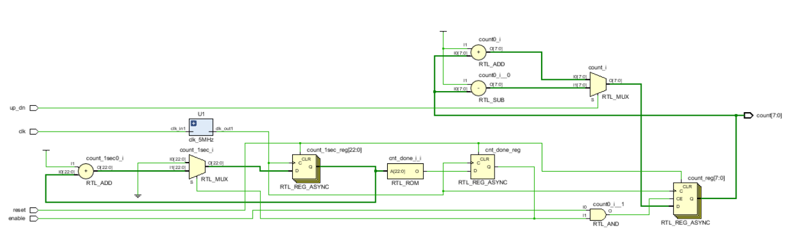

## 9-1-1 carry-look-ahead adder

#### Verilog code

#### Simulation

#### RTL Schematic Screen Shot

#### Synthesis

#### Implementation Device screen shot zoomed in on something interesting

#### Prompt

This is an adder. Carry look ahead adder improving speed by reducing the amount of time required to determine carry bits.

## Lab9-1-2

#### Verilog code

#### Simulation

#### RTL Schematic Screen Shot

#### Synthesis

#### Implementation Device screen shot zoomed in on something interesting

#### Prompt

Same as previous lab however Testbench created with defnam statements and that cause delay time to be changed. Also in the verilog code the parameters were assigned in the circuits created in the main verilog code circuit. 

## Lab9-2-1 

#### Verilog code

#### RTL Schematic Screen Shot

#### Synthesis

#### Implementation Device screen shot zoomed in on something interesting

#### Prompt

I created clk_5MHz. Counting from 255 down to 0. Each clock ticking counts down 1. SW0 is the clock enable and when it is off the counting stops. M18 is the reset and take the counter back to 255.

Number of BUFG/BUFGCTRL: 2 

Number of Slice LUTs used: 25 

Number of FF used: 32 

Number of DSP48E1 slices used: 0 

Number of IOs used: 12

## Lab9-2-2 

#### Verilog code

#### RTL Schematic Screen Shot

#### Synthesis

#### Implementation Device screen shot zoomed in on something interesting

#### Prompt

Same as previous one except this one forces synthesis to use DSP48 slices

This is the code (* use_dsp48 = "yes" *)

Number of BUFG/BUFGCTRL : 2 

Number of Slice LUTs used: 22

 Number of FF used: 33 

Number of DSP48E1 slices used: 2 

Number of IOs used: 12

## 9-2-3 _ updown_ctr_core_fabric

#### Verilog code

#### RTL Schematic Screen Shot

#### Synthesis

#### Implementation Device screen shot zoomed in on something interesting

#### Prompt

created clk_5Mhz and set up binary counter for 8 output width and final value to 15.

Deleted line 49 cause it was causing error(it is not needed).

enable 1 up_dn 1 =count up

enable 0 up_dn 1 =count down

Number of BUFG/BUFGCTRL: 2 

Number of Slice LUTs used: 27

 Number of registers used: 32 

Number of DSP48E1 slices used: 0

Number of IOs used: 12

## 9-2-4_updown_ctr_core_dsp48

#### Verilog code

#### RTL Schematic Screen Shot

#### Implementation Device screen shot zoomed in on something interesting

#### Prompt

created clk_5Mhz and set up binary counter for 8 output width and final value to 15.

Deleted line 49 cause it was causing error(it is not needed).

Just like previous lab but this time it is using DSP48 slices

Number of BUFG/BUFGCTRL : 2 

Number of Slice LUTs used: 18

 Number of registers used: 24 

Number of DSP48E1 slices used: 1 

Number of IOs used: 12

## 9-3-1 

#### Verilog code

#### RTL Schematic Screen Shot

#### Implementation Device screen shot zoomed in on something interesting

#### 

#### Prompt

When enable is 1, counting from 0 to 19 then restart. Basic stop watch.

## 9-3-2

#### Verilog code

#### RTL Schematic Screen Shot

#### Implementation Device screen shot zoomed in on something interesting

#### Prompt

When you turn SW6 and SW7 then you press BTNU to load. when enable is on the counter start counting down from 2.5 to 0.

## 9-3-3 

#### Verilog code

#### RTL Schematic Screen Shot

#### Implementation Device screen shot zoomed in on something interesting

#### Prompt

created clk wizard and binary counter.

this is  a counter(automatic)